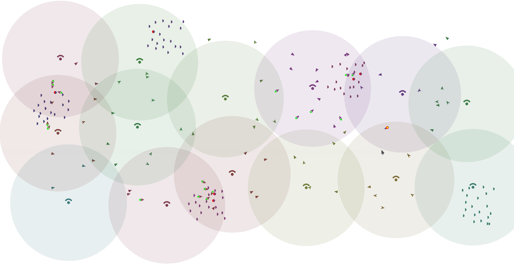
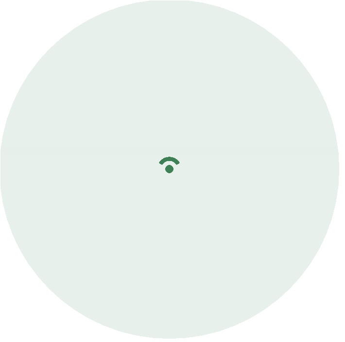

# Experiment for : A Programming Approach to Collective Autonomy
Repository for simulation results described in the [paper](https://github.com/metaphori/paper-2020-mdpi-jsan-si-autonomy) published into MDPI JSAN 2020.

The [report](REPORT.md) contains all experiments history. Each experiment has:
- A title that summarizes the goal;
- The research question addressed;
- Configuration/Dynamics;
- Snapshot;
- Relevant plots + corresponding description

For any issues with reproducing the experiments, please contact me
e.g. [via e-mail](mailto:gianluca.aguzzi@unibo.it).

## Overview

This repository contains the following

1. An implementation for a wildlife rescue scenario;
2. Simulation infrastructure (Alchemist-ScaFi) for assessing the implementation
3. Scripts and tools for running simulations

The following tools are used:

* [ScaFi](https://scafi.github.io): an aggregate programming framework
* [Alchemist](https://alchemistsimulator.github.io): a flexible (meta-)simulator for multi-agent systems
* Java 11: the platform upon which ScaFi and Alchemist run
* git: version control system for keeping track of this repository
* Gradle: build system automating compilation and execution of the application
* Python: for generating plots from data produced by sampling the simulations

## Getting started

### 1. Importing the repository

The first step is cloning this repository. 
It can be easily done by using git. 
Open a terminal, move it into an empty folder of your choice, 
then issue the following command:

```bash
# SSH
git clone git@github.com:cric96/experiment-2020-jsan-collective-autonomy.git
# Change directory to the repository
cd experiment-2020-jsan-collective-autonomy
```

### 2. Smoke test

This should make all the required files appear in your repository, with the latest version.

To check if everything works as expect, run the following command to start a GUI-based simulation (it may take some time to bootstrap):

```
./gradlew runGui
```

Once the GUI shows up, press `P` to start the simulation.

### 3. Open the project with an IDE

- **Eclipse**: open Eclipse, click on "File > Import" and then on "Gradle > Existing Gradle Project", then select the folder of the repository donwloaded in the previous step.
- **IntelliJ Idea**: similarly

## Project layout

The main files and directories of the project are the following:

- `build.gradle.kts`: the project build file; specifies dependencies and tasks
- `src/main/yaml/`: contains declarative simulation descriptors as YAML files
- `src/main/scala/`: contains implementation code

### Main source files

- `src/main/scala/it/unibo/casestudy/SpatialTuplesStorm.scala`: contains the program played by the nodes in the wildlife monitoring simulation described
  by file `src/main/yaml/wildlife-monitoring-mutable.yaml`

## Simulations about collective behaviour

Type

```bash
./gradlew exportData
```

for running the batch of experiments (NOTE: it requires a lot of resources and might take a lot of time).
Data produced by the simulator will be writted to directory data/ (the output is one CSV file per simulation run).

```bash
./plotter.py plot-config/default.yml data/ .* plots
```

### High-resolution plots

- [Plot 1](assets/result/paper/healer-count/healed-2.png)
- [Plot 2](assets/result/paper/healer-count/healed-4.png)
- [Plot 3](assets/result/paper/healer-count/healed-6.png)

### Simulation result



### GUI Shapes explanation

#### Station
They are fixed nodes. Here, the leader election happens. The circular area is an
approximation of the zone of leader influence.



#### Animal
Color information: each animal belongs to one group. The animals in the same group have the same color.
##### Healthy


##### In danger


#### Mobile nodes
Color information: each mobile node belongs to a zone created by sparse choice (S). The color is the same as the leader.
##### Healer


##### Healer in action
The healer's shape changes when he has an animal target.


##### Explorer

