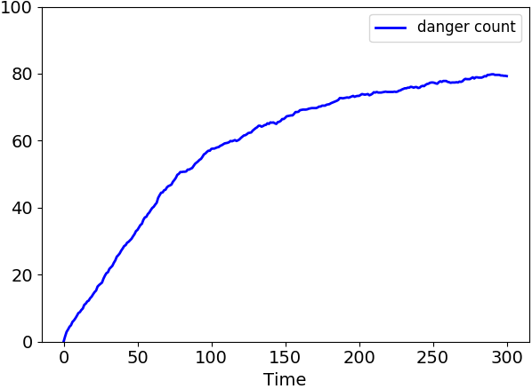

# Experiment #1 (31-01-2021) wildlife monitoring: rescue animals in danger. 

## **Research question**:  How different collectives affect the system? (Autonomy/structure relationship)

The environment is a flat square 2500 meters wides. The system has three nodes type:

1. "mobile nodes" (100 nodes) : capable to perceive and rescue animals in danger. 
   They explore the environment using "boids-like" dynamics. 
   They have a Bluetooth connection with a 200 meters range. 
   They send data sensed to a station and behave according 
   to station instructions.  The average velocity is 8.3 m/s.
2. station nodes (25 nodes): where the leader election happen. 
   They collect the data sensed by mobile nodes and then decide what animals should 
   be rescued. Currently, they choose the animal with the lowest id. 
   Conceptually, they are Lora gateways with 700 meters range.
3. "smart" collars (5 groups of 20 nodes): They send the id associated with an animal. 
   They have a Bluetooth connection with 200 meters range. The average animal velocity 
   is 8.3 m/s.

The network structure is inspired by this [paper](https://ieeexplore.ieee.org/abstract/document/8328721).
Mobiles drones are placed randomly. The stations are placed in a grid 5x5 covering the whole 
environment area.
The animals are divided into five groups placed, four in the square corner and one in the square 
centre.

The collective behaves following the SCR-pattern (leader election, data collection, 
information spreading). Here I try two movements configuration:
<ol type="a">
  <li> mobile nodes move according to the leader instruction but don't necessarily 
stay near it;</li>
  <li> after the leader election, mobile nodes tend to remain in the leader area.</li>
</ol>

Conceptually, b. could be more efficient than a. because nodes avoid wasting time to 
wander around. These two experiments could give us some insight for our research question.

**Synthetic Configuration**
- aggregate program frequency : 1 Hz
- aggregate program for mobile node: WildLifeMonitoring
- aggregate program for station: WildLifeMonitoring
- aggregate program for smart collar: AnimalBehaviour
- movement evaluation update : 10 Hz
- danger change molecule rate : 0.01 Hz
- simulation length : 300s
- environment size: 2500x2500 m
- mobile nodes count: 100
- animals nodes count: 100
- stations count : 25
- bluetooth range: 200 m
- lora range : 700 m
- average velocity : 8 m/s

**Experiment limitation**
- the "danger" sensing is very simplistic: "mobile nodes" check if the "danger" 
  molecule is set to true;
- the "rescue" action is also simplistic, it is instantaneous, and it changes *the* 
  *danger* molecule to false ;
- station program evaluation rate is the same as mobile node: here I imagine a program 
  evaluation frequency  lesser than others nodes;
- the collar evaluates an aggregate program for "broadcast" the danger status;
- the danger changing rate is surrealistic. 
- animals move like mobile nodes, namely simulating a flocking behavior. 
  Here we should use GPS track data for example. 
  I found [something](https://www.movebank.org/cms/movebank-main) but I can't export 
  data for Open Street Map. 

**Screenshot**

**Plots**
Currently, I plot only the danger count for each experiment. 
I run 20 simulations (10 with leader-tendency zone and 10 with fully-wander movement).
The leader tendency seems to bring a better system performance. 
In general, the structure has influenced the overall behavior.

*The plot of leader tendency tests.*

*The plot of wander tendency tests*